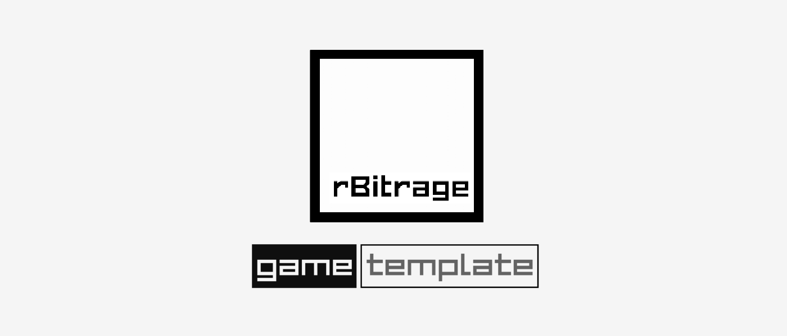

# rBitrage — A C++ Game Engine

Welcome! [rBitrage](https://github.com/SamuelAsherRivello/rBitrage) (aka "Arbitrage" aka "Bit Rage") is a custom C++ 2D/3D game engine built on the **Raylib** library.

> rBitrage is easy to learn, easy to use, and hard to misuse.

 

Read [C++ Gaming — 03 — The rBitrage Game Engine](https://samuel-asher-rivello.medium.com/c-gaming-03-the-rbitrage-game-engine-8b83814f679c) on Medium for more info.

 
 

<figure>

<figcaption>Image 1 - rBitrage C++ Game Engine </figcaption>
</figure>

 
 

### Features

 
 

|                                                             | **Raylib 2D/3D** | **Game Editor** | **Game Engine** | **Actors** | **Systems** | **Lifecycle** | **Camera** | **Input Mapping** | **Loader** |
| ----------------------------------------------------------- | ------------------- | --------------- | --------------- | ---------- | ----------- | ------------- | ---------- | ----------------- | ---------- |
| [rBitrage ](https://github.com/SamuelAsherRivello/rBitrage) | ✅                  | ❌              | ✅              | ✅         | ✅          | ✅            | ✅         | ✅                | ✅         |
| [Raylib](https://https://www.raylib.com/)                   | ✅                  | ❌              | ❌              | ❌         | ❌          | ❌            | ❌         | ❌                | ❌         |

 
 

### 💖 Support

_If you enjoy this content or you find it useful_, please share it, and please add a **Star**.

 
 

### Table of Contents

1. [Getting Started](#getting-started)
2. [Project Overview](#project-overview)
3. [Project Details](#project-details)
4. [Resources](#resources)
5. [Credits](#credits)

 
 

# Getting Started

Follow these steps to get started on your computer (e.g. Windows, Mac, Linux).

### Setup Environment

1. [Install Prerequisites](https://code.visualstudio.com/docs/cpp/config-mingw#_prerequisites), all steps, including ...
   - Install Visual Studio Code & Extension(s)
   - Install C++ Libraries
1. Open the [command line](https://cleanbrowsing.org/help/docs/working-with-windows-command-prompt-and-macos-terminal/#:~:text=perform%20various%20tasks.-,How%20to%20Access%20Command%20Prompt,bottom%20toolbar%20on%20your%20screen.)
1. Run each of the following command(s).
   - Run `gcc --version`
   - Run `g++ --version`
   - Run `gdb --version`
   - Run `mingw32-make --version`
1. Optional: Any failures? Ensure each is in your [Windows System Path Variables](https://www.youtube.com/watch?v=P8zMeCY2qtc), watch this [video](https://www.youtube.com/watch?v=oC69vlWofJQ), and repeat previous step(s)
1. Done!

### Setup Project

1. [Setup Environment](#setup-environment) per above
1. Download this repo (ZIP or GIT). Unzip as needed
1. Open **Visual Studio Code** & its Terminal Window
1. Run each of the following command(s). Any failures? Repeat previous steps
   - Run `mingw32-make setup`
1. Enjoy!

### Build Project

1. [Setup Project](#setup-project) per above
1. Open **Visual Studio Code** and its Terminal Window
1. Run each of the following command(s). Any failures? Repeat previous steps
   - Run `mingw32-make bin/app && mingw32-make execute`
1. Optional & Recommended: [Add keyboard shortcut](README-HOTKEYS.md)
1. Enjoy!

### Edit Project

1. Open **Visual Studio Code**
1. Open **Visual Studio Code**'s Explorer Window
1. Double-click on the `Main.cpp` file
1. Edit the `Main.cpp` file
1. Repeat [Build Project's](#build-project) previous steps
1. Enjoy!

 
 

# Project Overview

This repo demonstrates a project template for getting started easily with **rBitrage**.
Use cases for this repo include light-weight prototypes, educational projects, and commercial game development.

The rBitrage game engine can be used in **any** C++ environment.

This rBitrage template is specifically for use in **Visual Studio Code**.

 
 

### Screenshots

 

<figure>

<figcaption>Image 2 - Editor Environment (File Explorer, Terminal, Code Editor)</figcaption>
</figure>

 
 
 

<figure>

<figcaption>Image 3 - Runtime Environment (Game Window)</figcaption>
</figure>

 
 

### Structure

**Documentation**

- `ReadMe.md` - The primary documentation for this repo
- `Raylib/documentation/` - More info specific to the project

**Configuration**

- `Raylib/Makefile` - C++ build configuration file

**Structure**

- `Raylib` - Main project folder
- `Raylib/src/assets/` - User-facing game assets
- `Raylib/src/scripts/tests/` - Add unit testing files here
- `Raylib/src/scripts/client/` - Add runtime files here
- `Raylib/src/scripts/client/Main.cpp` - Main file for game logic. Do your work here :)

**Dependencies**

- `Raylib/vendor/` - Lists vendor as dependencies...

 
 

# Project Details

 

### Roadmap

Here is the status and roadmap of project template features.

|                                                            | **Coding Standards** | **Project Structure** | **C++ IntelliSense** | **C++ Compilation** | **Hot Reloading** | **Unit Testing** | **CI/CD** |
| ---------------------------------------------------------- | -------------------- | --------------------- | -------------------- | ------------------- | ----------------- | ---------------- | --------- |
| [rBitrage](https://github.com/SamuelAsherRivello/rBitrage) | ✅                   | ✅                    | ✅                   | ✅                  | ❌                | ❌               | ❌        |

 

### Editor Tooling & Libraries

| Name                                                                                                       | Description                                | In Repo? | In Steps Above? |
| ---------------------------------------------------------------------------------------------------------- | ------------------------------------------ | -------- | --------------- |
| [Visual Studio Code](https://code.visualstudio.com/)                                                       | Source code editor                         | ❌       | ✅              |
| [Visual Studio Code C++ Extension](https://marketplace.visualstudio.com/items?itemName=ms-vscode.cpptools) | IntelliSense, debugging, and code browsing | ❌       | ✅              |
| [C++ Libraries](https://code.visualstudio.com/docs/cpp/config-mingw#_prerequisites)                        | Including compilers for C++                | ❌       | ✅              |
| [Raylib](https://https://www.raylib.com/)                                                                  | Simple and easy-to-use library             | ✅       | ❌              |
| [rBitrage](https://github.com/SamuelAsherRivello/rBitrag)                                                  | C++ 2D/3D game engine                      | ✅       | ❌              |

 
 

# Resources

Here are some resources which may be helpful with C++ and game development.

### Samuel Asher Rivello

- [C++ Gaming — 01 — Overview](https://samuel-asher-rivello.medium.com/c-gaming-01-overview-ee62d88a9c84)
- [C++ Gaming — 02 — Raylib Project Template](https://samuel-asher-rivello.medium.com/c-gaming-02-raylib-project-template-c1c9f41df980)
- [C++ Gaming — 03 — The rBitrage Game Engine](https://samuel-asher-rivello.medium.com/c-gaming-03-the-rbitrage-game-engine-8b83814f679c)

### Raylib

- [Raylib](https://www.raylib.com/)
- [Raylib Cheatsheet](https://www.raylib.com/cheatsheet/cheatsheet.html) ← Start here :)
- [Raylib Documentation](https://github.com/raysan5/raylib/wiki)
- [Raylib Examples](https://www.raylib.com/examples.html) & [Raylib Games](https://www.raylib.com/games.html)

 

# Credits

**Created By**

- Samuel Asher Rivello
- Over 25 years XP with game development (2024)
- Over 11 years XP with Unity (2024)

**Contact**

- Twitter - <a href="https://twitter.com/srivello/">@srivello</a>
- Git - <a href="https://github.com/SamuelAsherRivello/">Github.com/SamuelAsherRivello</a>
- Resume & Portfolio - <a href="http://www.SamuelAsherRivello.com">SamuelAsherRivello.com</a>
- LinkedIn - <a href="https://Linkedin.com/in/SamuelAsherRivello">Linkedin.com/in/SamuelAsherRivello</a> <--- Say Hello! :)

**License**

Provided as-is under MIT License | Copyright © 2024 Rivello Multimedia Consulting, LLC
